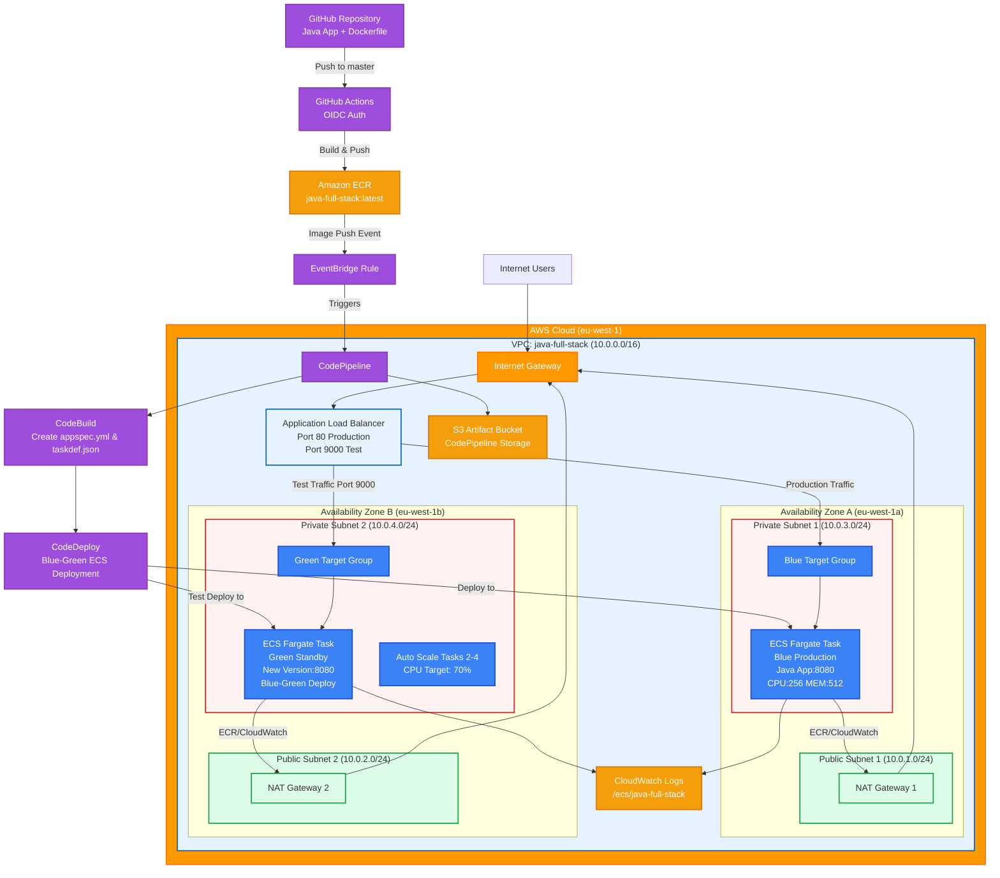

# ECS CI/CD Lab: Complete Build Guide

A step-by-step guide to building a highly available, containerized Java web application on AWS ECS with automated blue-green deployments.

## Architecture Overview



## What You'll Build

- **High-Availability Infrastructure**: Multi-AZ VPC with public/private subnets, ALB, NAT Gateways
- **Containerized Application**: Java web app running on ECS Fargate in private subnets
- **Blue-Green CI/CD Pipeline**: Automated deployments triggered by ECR image pushes
- **Security**: OIDC authentication, security groups, private subnet isolation
- **Monitoring**: CloudWatch logs, auto-scaling based on CPU metrics

## Prerequisites

- AWS CLI configured with appropriate permissions
- GitHub account
- Basic knowledge of AWS services, Docker, and CloudFormation

## Repository Structure

You'll need two separate repositories:

### 1. Infrastructure Repository
```
ecs-cicd-infrastructure/
├── infrastructure.yaml    # Core VPC, ECS, IAM resources
├── service.yaml          # ECS service, target groups, CodeDeploy
├── pipeline.yaml         # CodePipeline, CodeBuild, EventBridge
└── README.md
```

### 2. Application Repository
```
ecs-cicd-lab-app/
├── src/
│   └── main/
│       ├── java/          # Spring Boot application
│       └── resources/
│           └── static/
│               ├── index.html
│               └── style.css
├── Dockerfile
├── build.gradle
├── .github/
│   └── workflows/
│       └── deploy-to-ecr.yml
└── README.md
```

## Step-by-Step Build Process

### Phase 1: Infrastructure Setup

#### Step 1: Create Infrastructure Repository

1. **Create a new GitHub repository** named `ecs-cicd-infrastructure`

2. **Create the core infrastructure template** (`infrastructure.yaml`):
   - VPC with CIDR 10.0.0.0/16
   - 2 Public subnets (10.0.1.0/24, 10.0.2.0/24) across different AZs
   - 2 Private subnets (10.0.3.0/24, 10.0.4.0/24) across different AZs
   - Internet Gateway and NAT Gateways for HA
   - Security Groups (ALB and ECS)
   - ECR Repository
   - ECS Cluster
   - Application Load Balancer with target groups
   - IAM roles for ECS tasks, CodePipeline, CodeDeploy, and GitHub OIDC

#### Step 2: Deploy Core Infrastructure

```bash
# Clone your infrastructure repository
git clone https://github.com/YOUR_USERNAME/ecs-cicd-infrastructure.git
cd ecs-cicd-infrastructure

# Deploy the infrastructure stack
aws cloudformation create-stack \
    --stack-name java-full-stack-infrastructure \
    --template-body file://infrastructure.yaml \
    --parameters ParameterKey=GitHubRepoOwner,ParameterValue=YOUR_GITHUB_USERNAME \
                ParameterKey=GitHubRepoName,ParameterValue=ecs-cicd-lab-app \
    --capabilities CAPABILITY_IAM \
    --region eu-west-1
```

**Key Infrastructure Components Created:**
- **VPC**: Custom VPC with public/private subnet architecture
- **ECR Repository**: For storing container images
- **ECS Cluster**: Fargate cluster for running containers
- **ALB**: Internet-facing load balancer with health checks
- **Security Groups**: Restrictive inbound/outbound rules
- **IAM Roles**: GitHub OIDC role for secure CI/CD

#### Step 3: Deploy ECS Service Stack

```bash
# Deploy the service stack
aws cloudformation create-stack \
    --stack-name java-full-stack-service \
    --template-body file://service.yaml \
    --capabilities CAPABILITY_IAM \
    --region eu-west-1
```

**Service Components:**
- **ECS Task Definition**: Container specs (CPU: 256, Memory: 512)
- **ECS Service**: Maintains desired task count with blue-green deployment controller
- **Target Groups**: Blue (production) and Green (test) target groups
- **Auto Scaling**: CPU-based scaling (target 70%, min 1, max 4 tasks)
- **CodeDeploy Application**: Blue-green deployment configuration

#### Step 4: Deploy CI/CD Pipeline

```bash
# Deploy the pipeline stack
aws cloudformation create-stack \
    --stack-name java-full-stack-pipeline \
    --template-body file://pipeline.yaml \
    --capabilities CAPABILITY_IAM \
    --region eu-west-1
```

**Pipeline Components:**
- **CodePipeline**: 3-stage pipeline (Source → Build → Deploy)
- **CodeBuild**: Creates deployment artifacts (appspec.yml, taskdef.json)
- **EventBridge Rule**: Triggers pipeline on ECR image push
- **S3 Artifact Bucket**: Stores build artifacts

### Phase 2: Application Setup

#### Step 5: Create Application Repository

1. **Create application repository** named `ecs-cicd-lab-app`

2. **Create a simple Java Spring Boot application**:

```java
// src/main/java/com/example/Application.java
@SpringBootApplication
@Controller
public class Application {
    
    @GetMapping("/")
    public String home() {
        return "index";
    }
    
    public static void main(String[] args) {
        SpringApplication.run(Application.class, args);
    }
}
```

3. **Create the UI** (`src/main/resources/static/index.html`):

```html
<!DOCTYPE html>
<html>
<head>
    <title>ECS CICD Lab</title>
    <link rel="stylesheet" href="style.css">
</head>
<body>
    <div class="container">
        <h1>Hello World!</h1>
        <p><b>Name:</b> YOUR_FULL_NAME</p>
        <p><b>Lab:</b> ECS CICD!</p>
    </div>
</body>
</html>
```

4. **Create Dockerfile**:

```dockerfile
FROM openjdk:21-jdk-slim

WORKDIR /app

# Copy gradle files
COPY build.gradle settings.gradle gradlew ./
COPY gradle gradle

# Copy source code
COPY src src

# Build application
RUN ./gradlew build --no-daemon

# Expose port
EXPOSE 8080

# Run application
CMD ["java", "-jar", "build/libs/app.jar"]
```

#### Step 6: Configure GitHub Actions CI/CD

1. **Get the GitHub OIDC Role ARN** from CloudFormation outputs:

```bash
aws cloudformation describe-stacks \
    --stack-name java-full-stack-infrastructure \
    --query 'Stacks[0].Outputs[?OutputKey==`GitHubOIDCRoleArn`].OutputValue' \
    --output text
```

2. **Add GitHub repository secrets**:
   - `AWS_IAM_ROLE_ARN`: The OIDC role ARN from step 1
   - `ECR_REPOSITORY_NAME`: `java-full-stack`

3. **Create GitHub Actions workflow** (`.github/workflows/deploy-to-ecr.yml`):

```yaml
name: Build and Push to ECR

on:
  push:
    branches: [ "master" ]

permissions:
  id-token: write
  contents: read

jobs:
  build-and-push:
    runs-on: ubuntu-latest
    steps:
      - name: Checkout
        uses: actions/checkout@v4

      - name: Set up JDK 21
        uses: actions/setup-java@v4
        with:
          java-version: '21'
          distribution: 'temurin'

      - name: Grant execute permission for gradlew
        run: chmod +x gradlew

      - name: Build with Gradle
        run: ./gradlew build --no-daemon

      - name: Configure AWS Credentials via OIDC
        uses: aws-actions/configure-aws-credentials@v4
        with:
          role-to-assume: ${{ secrets.AWS_IAM_ROLE_ARN }}
          aws-region: eu-west-1

      - name: Login to Amazon ECR
        id: login-ecr
        uses: aws-actions/amazon-ecr-login@v2

      - name: Build, tag, and push image to Amazon ECR
        env:
          ECR_REGISTRY: ${{ steps.login-ecr.outputs.registry }}
          ECR_REPOSITORY: ${{ secrets.ECR_REPOSITORY_NAME }}
          IMAGE_TAG: ${{ github.sha }}
        run: |
          docker build -t $ECR_REGISTRY/$ECR_REPOSITORY:$IMAGE_TAG .
          docker tag $ECR_REGISTRY/$ECR_REPOSITORY:$IMAGE_TAG $ECR_REGISTRY/$ECR_REPOSITORY:latest
          docker push $ECR_REGISTRY/$ECR_REPOSITORY:$IMAGE_TAG
          docker push $ECR_REGISTRY/$ECR_REPOSITORY:latest
```

### Phase 3: Deploy and Test

#### Step 7: Trigger First Deployment

1. **Push your application code** to the master branch
2. **Monitor the pipeline**:

```bash
# Watch GitHub Actions
# Visit: https://github.com/YOUR_USERNAME/ecs-cicd-lab-app/actions

# Monitor CodePipeline
aws codepipeline get-pipeline-state \
    --name java-full-stack-Pipeline \
    --region eu-west-1
```

3. **Get your application URL**:

```bash
aws cloudformation describe-stacks \
    --stack-name java-full-stack-service \
    --query 'Stacks[0].Outputs[?OutputKey==`ServiceURL`].OutputValue' \
    --output text
```

#### Step 8: Verify Deployment

1. **Check ECS Service Status**:

```bash
aws ecs describe-services \
    --cluster java-full-stack-Cluster \
    --services java-full-stack-Service \
    --region eu-west-1
```

2. **View CloudWatch Logs**:

```bash
aws logs describe-log-streams \
    --log-group-name /ecs/java-full-stack \
    --region eu-west-1
```

3. **Test Blue-Green Deployment**:
   - Production traffic: `http://YOUR_ALB_DNS_NAME`
   - Test traffic during deployment: `http://YOUR_ALB_DNS_NAME:9000`

## Key Features Implemented

### High Availability
- **Multi-AZ deployment** across 2 availability zones
- **Auto Scaling** based on CPU utilization (70% target)
- **Load balancing** with health checks
- **NAT Gateway redundancy** for outbound internet access

### Security Best Practices
- **Private subnets** for ECS tasks (no direct internet access)
- **Security groups** with minimal required permissions
- **OIDC authentication** (no long-lived AWS credentials in GitHub)
- **IAM roles** with least privilege access

### Blue-Green Deployment
- **Zero-downtime deployments** using CodeDeploy
- **Automated rollback** on deployment failure
- **Test listener** on port 9000 for validation
- **Traffic shifting** from blue to green on success

### Monitoring and Logging
- **CloudWatch Logs** for application logs
- **ECS Service metrics** for monitoring
- **Auto Scaling metrics** for CPU utilization

## Troubleshooting Guide

### Common Issues

**1. Pipeline Fails at ECR Source Stage**
```bash
# Ensure ECR repository has images
aws ecr describe-images --repository-name java-full-stack --region eu-west-1
```

**2. ECS Tasks Fail to Start**
```bash
# Check ECS task logs
aws logs get-log-events \
    --log-group-name /ecs/java-full-stack \
    --log-stream-name ecs/java-full-stack-Container/TASK_ID
```

**3. GitHub Actions OIDC Authentication Fails**
- Verify the OIDC role ARN in GitHub secrets
- Check the trust policy allows your GitHub repository

**4. Application Not Accessible**
- Verify security groups allow traffic on required ports
- Check ALB health checks are passing
- Ensure ECS tasks are in RUNNING state

### Useful Commands

```bash
# View stack outputs
aws cloudformation describe-stacks --stack-name STACK_NAME

# Check ECS service status
aws ecs describe-services --cluster CLUSTER_NAME --services SERVICE_NAME

# View pipeline execution
aws codepipeline list-pipeline-executions --pipeline-name PIPELINE_NAME

# Check auto scaling activities
aws application-autoscaling describe-scaling-activities \
    --service-namespace ecs \
    --resource-id service/CLUSTER_NAME/SERVICE_NAME
```

## Cost Optimization

- **Fargate Spot** can reduce costs by up to 70%
- **NAT Instance** instead of NAT Gateway for development
- **CloudWatch Log retention** set to 7 days
- **Auto Scaling** ensures you only pay for what you use

## Next Steps

1. **Add monitoring dashboards** using CloudWatch
2. **Implement health checks** for better reliability
3. **Add secrets management** using AWS Systems Manager
4. **Set up notifications** for deployment status
5. **Configure custom domains** using Route 53

## Repository Links

- **Infrastructure**: `https://github.com/YOUR_USERNAME/ecs-cicd-infrastructure`
- **Application**: `https://github.com/YOUR_USERNAME/ecs-cicd-lab-app`
- **Live Application**: `http://YOUR_ALB_DNS_NAME`

## Architecture Benefits

This architecture provides:
- **99.9% availability** through multi-AZ deployment
- **Zero-downtime deployments** via blue-green strategy
- **Automatic scaling** based on demand
- **Security isolation** with private subnets
- **GitOps workflow** with infrastructure as code
- **Cost optimization** through auto scaling and Fargate